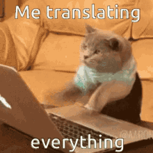

#   ESPAÑOL:

## <i align="center" style="font-size:2rem">🏆 TRADUCTOR CON REACT</i>

En este proyecto se utilizaron hooks como **useState,useEffect,useContext**  , tecnologias como **HTML,CSS,JavaScript,React,SASS** y herramientas extra como **FontAwesome (Iconos)**

_Este proyecto fue realizado con el proposito de practicar React_

## 💡 Como se penso este proyecto y como funciona

**_Idea Principal : Un traductor_**

Las APIS que se utilizaron fueron :
- [Text Translator](https://text-translator2.p.rapidapi.com)
- [Text To Speech](https://text-to-speech-api3.p.rapidapi.com/)

Primero que nada me concentre en el diseño de la aplicacion , por que en lo que se refiere a logica no me parecio en un principio muy complicado .

Para los estilos utilice SASS, ya que me siento muy comodo trabajando con el y me parece una herramienta muy eficaz para acelerar el desarrollo ,y dotar con esteroides a CSS.

La idea era sencilla , poder tener una aplicacion de Traductor , en el que pudieras elegir el idioma Origen y el idioma Destino , y que se tradujera lo que se coloque en un campo determinado . Me inspire mucho en los diseos de Google Translate (https://translate.google.com) y DeepL Translate (https://www.deepl.com/es/translator/) (Ya que son 2 de los traductores que mas utilizo día a día)

Primero que nada ,todos mis estados estaban dentro de un contexto , esto para que toda la app tenga acceso a ellos y sea mas facil el traspaso de estos a lo largo de toda la aplicacion.
Al cargar la aplicacion se obtiene todos los idiomas que soporta y puede traducir la Api , esto a traves del efecto principal sin dependencias que configure previamente y realiza la peticion al endpoint ('https://text-translator2.p.rapidapi.com/getLanguages'),y la respuesta llena el primer estado de la aplicacion llamado **_"languages"_**

Cuando **_"Languages"_** posee informacion , se realiza el renderizado condicional donde se  renderizan las diferentes opciones  para seleccionar lenguage tanto de Origen como de Destino.

Al seleccionar los diferentes lenguages tanto de Destino como de Origen , se rellenan los estados correspondientes a estos : **_"languageSource"_**,**_"languageTarget"_**.

El usuario ya puede escribir lo que desee en la zona de traduccion pero por obvias razones no se va a traducir nada ya que para que funcione el traductor se necesita que se hayan seleccionado previamente los 2 lenguages. Si esta condicion se cumple ya se puede realizar la traduccion.

Lo que el usuario escriba dentro de la zona de traduccion se guarda en el estado llamado **_"textToTranslate"_** y por cada caracter que este escriba se va a realizar una peticion fetch hacia la api con la informacion que este estado posea y con la informacion de los 2 lenguages . La respuesta de la API va a llenar el estado **_"textTranslated"_**, que no es mas que la traduccion del texto original al lenguage deseado .

La zona de traduccion tiene 2 opciones diferentes : Una permite borrar el contenido escrito y por lo tanto limpiar el estado  **_"textToTranslate"_** y subsecuentemente el estado **_"textTranslated"_**. La otra opcion es para que un narrador pueda hablar tanto el texto a traducir como el texto traducido .
(Aclaracion 1: Esta funcion es un poco lenta asi que tarda un poco en hablar el narrador )
(Aclaracion 2: El narrador soporta la mayoria de lenguages , pero siempre hay una excepcion al caso .Cuando no soporte la voz no aparecera el icono )

La funcion del narrador implementa la API de _"Text to Speech"_ al hacer click en el icono del narrador/volumen , se realiza una peticion fetch enviando por parametros el texto a traducit y el lenguage en el cual va a hablar . Previamente se realiza una verificacion para ver si el narrador posee la voz correspondiente

-----------------------------------------------------------------------------------------------------
-----------------------------------------------------------------------------------------------------

#  ENGLISH:

## <i align="center" style="font-size:2rem">📚 TRANSLATE REACT</i>

In this project was used hooks like **useState,useEffect,useContext** , technologies like **HTML,CSS,JavaScript,React,SASS** and extra tools like **FontAwesome (Icons)**

_This project was built with the purposo of practise React_

## 🤔 How this project was thinked and how it works
**Main Idea : A translate App**

The APIs that was used :
- [Text Translator](https://text-translator2.p.rapidapi.com)
- [Text To Speech](https://text-to-speech-api3.p.rapidapi.com/)

First of all , I putted on my concern in the design of the app because in the topic "logic" I thinked : "Well, it´s not going to be so difficult "

So I used SASS for the styles ,it is very comfortable to work and is a tool very effective for accelerate develop and  give to CSS  steroids

The idea "in the papers" was so simple, build an app of Translate, in that you can  choose Source Language, Target language and write in an input ,the text to translate , and the app translate  text
I taked inspiration in the design of Google Translate (https://translate.google.com) and DeepL Translate (https://www.deepl.com/es/translator/) (This two are my frecuent translates)

First of any , all my entire states was into a Context, this was for that entire app can has access to their and was more easier communicate their along the entire app.
At the moment to load the app , It get all the languages that supports and can translate from the API , this through of the principal useEffect without any dependencies that I setted previously.It do the fetch to the API  endpoint ('https://text-translator2.p.rapidapi.com/getLanguages'), the response will fill  the first state od the app called **_"languages"_**

When **_"Languages"_** has any information, it will be render the different language options for Target and Source

At the moment of select two languages , Will be fill two states of languages :  **_"languageSource"_**,**_"languageTarget"_**

The user can write anything in the traduction zone but if he does not select previously the 2 languages ,the text won´t never translate . This condition is the main for the user get his translation

All that user writes into the traduction zone it will be save in an state called **_"textToTranslate"_** . Each caracter that write  will produce a fetch to the API with this text containes into the traduction zone and with the information of two languages. The API response will be fill the state **_"textTranslated"_** that is not more of the translate of the text to the target language

Translate zone has two options: With one you can delete all content into it and therefore clean the state  **_"textToTranslate"_** and too  the state **_"textTrasnlated"_**. With the other one , an storyteller can speech the texto translated and text to translate 
(Aclaration 1: This function is a little bit slow so the storyteller can has a delay to speech)
(Aclaration 2: The storyteller supports a big part of languages but it can has the exception to the case . So if the storyteller icon appears in screen , this means can support the language)

Storyteller function was implemented thanks to the API **_"Text to Speech"_**. When user clicks storyteller icon , will be do a fetch to the API sending in it the text to speech and the lenguage of speech. Previously ,a check was done  to check if the narrator has the voice/language

